# FlutterSnippet

## 声明： 如果有任何代码侵权，请联系我wyn18968158629@gmail.com。

**在项目使用到或者网上看到好的组件，整理一份方便以后开发的时候使用。**

## 1. FlutterText 字体抖动

一个字体抖动的组件，继承自Text。用法和Text一样，可以设置Text的所有属性。 可以传入一个动画的配置项，实现动画。支持重复播放。 使用示例：

```
FlutterText(
              "我们都是孩子",
              style: const TextStyle(fontSize: 30, color: Colors.cyan),
              config: AnimationConfig(curveTween: CurveTween(curve: Curves.ease), repeat: true),
            ),
```


## 2. NormalCell 一行显示左边的图标，标题，和右边的尾部组件

提供了（1）标题图片（2）标题（3）内容（4）尾部内容（或箭头）（5）是否需要底部分割线（6）点击事件 使用示例：

```
const NormalCell(leading: Text("leading"), title: Text("title"), middle: Text("middle"), trailing: Text("trailing")),
```

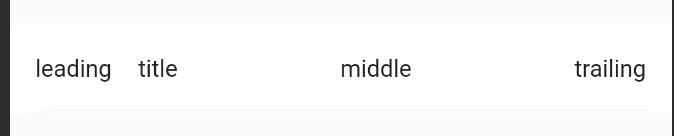

## 3. NStarView 多边形

绘制多边形，传入多边形的个数n，外半径R，内半径r，填充的颜色color 使用示例：

```
NStarView(15, 30, 20, color: Colors.red,)
```

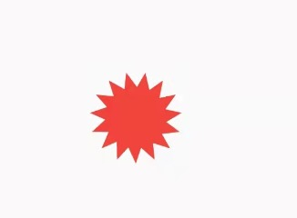

## 4. AbilityWidget 蛛网显示能力图

蛛网的样式显示不同能力值，并伴有动画。 使用示例：

```
AbilityWidget(
          ability: Ability(100, 1500, AssetImage("images/namei.png"), {
            "攻击力": 70.0,
            "生命": 90.0,
            "闪避": 50.0,
            "暴击": 70.0,
            "破格": 80.0,
            "格挡": 100.0,
          }, Colors.black),
        ),
```

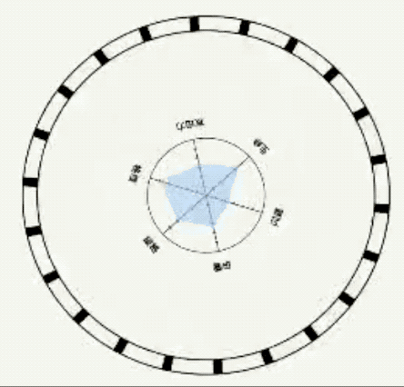

## 5. CircleProgressWidget 圆形进度条

通过Progress来设置属性. 使用时设置动画，可实现动态显示 使用示例：

```
CircleProgressWidget(Progress(value: value, backgroundColor: Colors.red))
```

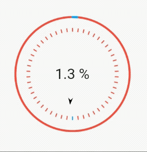

## 6. FlutterWebView 浏览器

传入url和title，打开新页面在浏览器展示内容。 iOS使用时，需要在ViewDidLoad中添加`GeneratedPluginRegistrant.register(with: self)`。
使用示例：

```
Navigator.of(context).push(
              MaterialPageRoute(builder: (BuildContext context) {
                return const FlutterWebView(
                    "http://www.baidu.com",
                    title: "我就是我");
              }));
```

*需要在pubspec.yaml中依赖webview_flutter: ^2.1.1*

## 7. MathRunner 按函数移动

封装了一个动画，传入x和y的函数，使组件按函数动起来。 使用示例：

```
Stack(
        alignment: Alignment.center,
        children: <Widget>[
          const CircleAvatar(
            backgroundImage: AssetImage("images/namei.png"),
          ),
          MathRunner(
            f: (t) => cos(t * pi),
            g: (t) => 0.6 * sin(t * pi),
            reverse: false,
            parts: 4,
            index: 0,
            child: const CircleAvatar(
              backgroundImage: AssetImage("images/namei.png"),
            ),
          ),
          MathRunner(
            f: (t) => cos(t * pi),
            g: (t) => 0.6 * sin(t * pi),
            reverse: false,
            parts: 4,
            index: 1,
            child: const CircleAvatar(
              backgroundImage: AssetImage("images/namei.png"),
            ),
          ),
          MathRunner(
            f: (t) => cos(t * pi),
            g: (t) => 0.6 * sin(t * pi),
            reverse: false,
            parts: 4,
            index: 2,
            child: const CircleAvatar(
              backgroundImage: AssetImage("images/namei.png"),
            ),
          ),
          MathRunner(
            f: (t) => cos(t * pi),
            g: (t) => 0.6 * sin(t * pi),
            reverse: false,
            parts: 4,
            index: 3,
            child: const CircleAvatar(
              backgroundImage: AssetImage("images/namei.png"),
            ),
          ),
        ],
      )
```

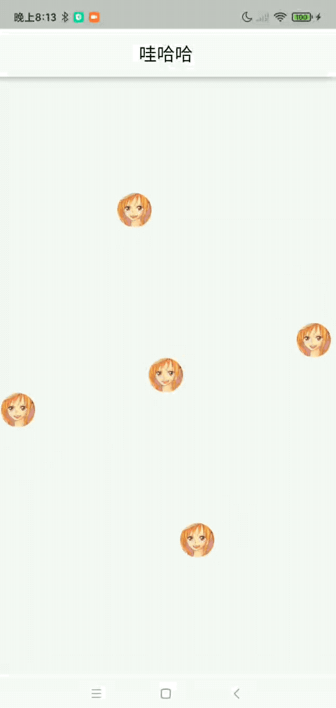

## 8. 评分

StarScore显示评分结果 CustomRating打分 使用示例：

```
Column(
  mainAxisSize: MainAxisSize.min,
  children: <Widget>[
    CustomRating(
      onRating: (double d) {
        debugPrint("score is $d");
      },
    ),
    StarScore(
      score: 3.0,
      tail: Column(
        children: const <Widget>[Text("综合评分"), Text("3.0")],
      ),
    ),
  ],
),
```


## 9. ToggleRotate 点击旋转组件

点击一个组件的时候，可以将组件旋转到指定的角度，并可指定动画效果。 使用示例：

```
ToggleRotate(
  onTap: () {},
  child: const Icon(
    Icons.arrow_upward,
    size: 60,
    color: Colors.orangeAccent,
  ),
  durationMs: 500,
  curve: Curves.bounceInOut,
),
```

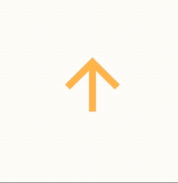

## 10. CouponShapeBorder 优惠券

用自定义shape绘制外边框的形状，实现优惠券的样式 使用示例：

```
Material(
color: Colors.red,
shape: const CouponShapeBorder(),
elevation: 2,
child: Container(
padding: const EdgeInsets.all(10),
height: 150,
child: Row(
  mainAxisSize: MainAxisSize.max,
  children: <Widget>[
    Flexible(
      flex: 718,
      child: Center(
        child: Column(
          mainAxisAlignment: MainAxisAlignment.center,
          children: <Widget>[
            Row(
              mainAxisAlignment: MainAxisAlignment.center,
              mainAxisSize: MainAxisSize.min,
              children: <Widget>[
                const Text(
                  "￥",
                  style: TextStyle(
                      color: Colors.white, fontSize: 17),
                ),
                const Text(
                  "200",
                  style: TextStyle(
                      color: Colors.white,
                      fontSize: 60,
                      fontWeight: FontWeight.bold),
                ),
                Column(
                  mainAxisSize: MainAxisSize.min,
                  children: const <Widget>[
                    Text(
                      "优",
                      style: TextStyle(
                          color: Colors.white, fontSize: 12),
                    ),
                    Text(
                      "惠",
                      style: TextStyle(
                          color: Colors.white, fontSize: 12),
                    ),
                    Text(
                      "券",
                      style: TextStyle(
                          color: Colors.white, fontSize: 12),
                    ),
                  ],
                ),
              ],
            ),
            const Text(
              "订单满599元使用",
              style: TextStyle(
                  color: Colors.black45, fontSize: 20),
            )
          ],
        ),
      ),
    ),
    const Flexible(
      flex: 282,
      child: Center(
        child: SizedBox(
          width: 10,
          child: Text(
            "立即领取",
            style:
                TextStyle(color: Colors.yellow, fontSize: 20),
          ),
        ),
      ),
    ),
  ],
),
),
),
```

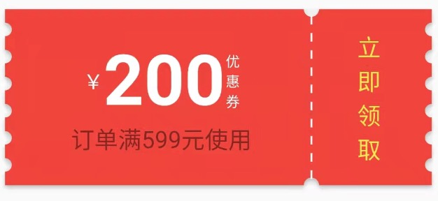

## 11. FlutterWaveLoading 波浪加载

滚动的波浪，可以设置进度。 使用示例

```
const FlutterWaveLoading(
    width: 75,
    height: 75,
    isOval: false,
    progress: 0.5,
    waveHeight: 3,
    color: Colors.cyan,
    curve: Curves.bounceInOut,
),
```

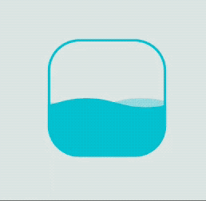

## 12. PointsCurve 根据多点绘制直线和曲线

根据多个坐标，用直线和贝塞尔曲线连接。 可以设置直线的颜色和坐标点的颜色，圆的半径。 可以设置曲线的颜色和线的宽度。 使用示例：

```
const SizedBox(
    height: 500,
    child: PointsCurve([
      Offset(0, 20),
      Offset(40, 40),
      Offset(80, -20),
      Offset(120, -40),
      Offset(160, -80),
      Offset(200, -20),
      Offset(240, -40),
    ],),
),
```

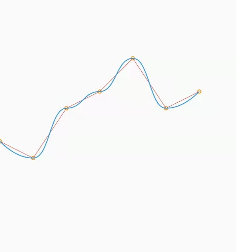

## 13. EfficientPage 联动滚动页面

通过局部更新的方式，来降低全局刷新 使用示例：

```
const EfficientPage()
```

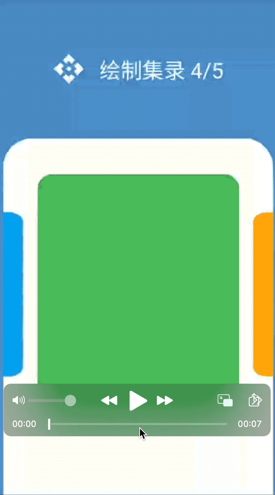

## 14. Wave 类似水波的效果，可以设置一个中心圆，然后一个波动的圆。

波动波动。 使用示例：

```
Wave(),
Wave(
    waveSize: Size(100, 200),
    centerColor: Colors.black,
    waveColor: Colors.red,
    centerRadius: 20,
    durationMilliseconds: 3000,
    isWaveUp: false,
),
```

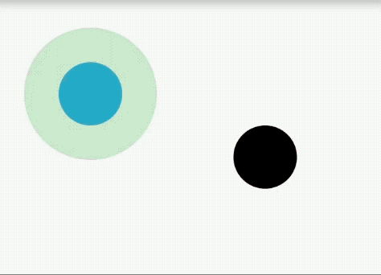

## 15. Clock 钟表

表盘绘制一次，时分秒针每秒更新。 如果项目中要用到，需要将颜色提取出来，作为变量。 使用示例：

```
Clock()
```

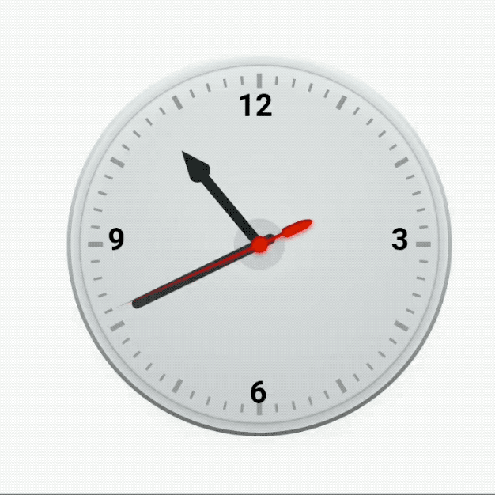

## 16 Umbrella

使用绘制60度的一个小三角来组成一个伞面 可以填充彩虹色 Beta 还有很多小问题 使用示例：

```
Umbrella()
```

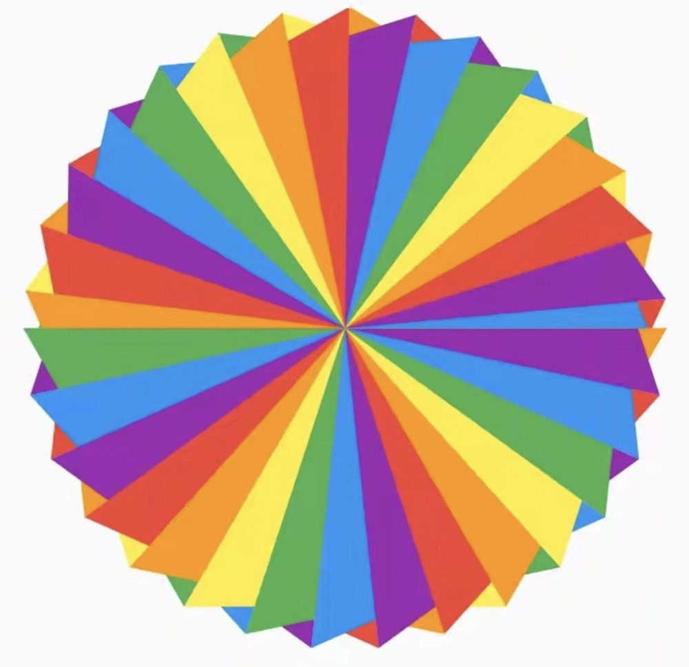

## 17 Rainbow

使用一道彩虹。可以设置大小。 使用示例：

```
Rainbow()
```

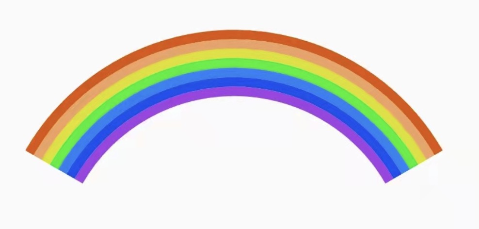

## 18 RedPacket

模仿微信的红包，弹出红包，点击"开"按钮后，旋转金币，然后跳转到结果页面。 使用示例：

```
@override
  Widget build(BuildContext context) {
    super.build(context);

    return Column(
      crossAxisAlignment: CrossAxisAlignment.start,
      children: <Widget>[
        const Padding(padding: EdgeInsets.only(top: 50)),
        ElevatedButton(
          onPressed: () {
            showRedPacket(context, onOpen);
          },
          child: const Text("点我领红包"),
        ),
      ],
    );
  }

  void onOpen() {
    Navigator.push(
        context,
        PageRouteBuilder(
            pageBuilder: (context, animation, secondaryAnimation) =>
                FadeTransition(
                  opacity: animation,
                  child: const ResultPage(),
                ),
            transitionDuration: const Duration(seconds: 1)));
```

ResultPage是结果页面，任意页面都可以。
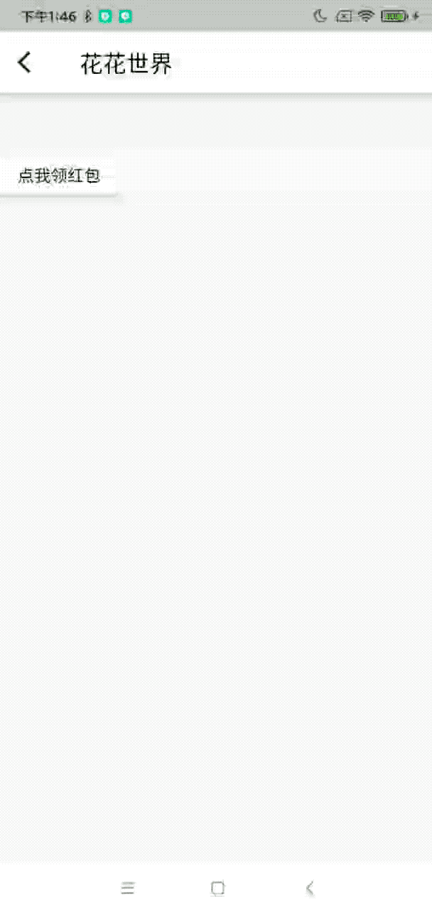

## 19. 兔子

使用CustomPainter绘制兔子，并采用animation控制绘制的进度。 使用示例：

```
Rabbit();
```

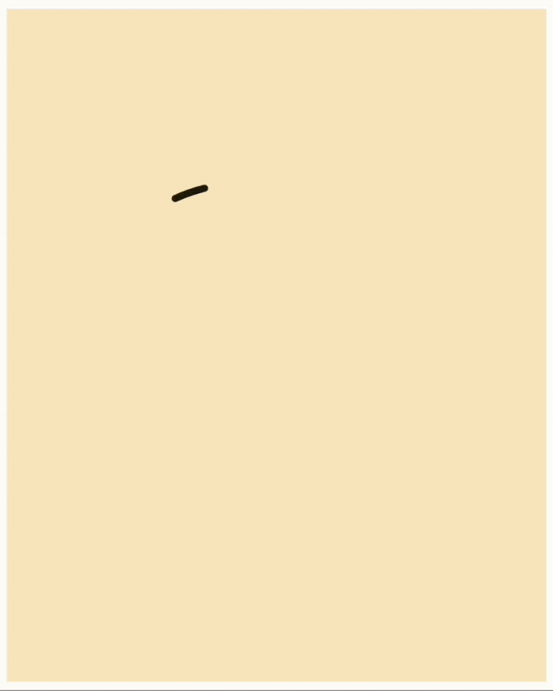

## 20. 变色气泡

聊天气泡，滚动的时候根据位置展示渐变的背景色。 渐变色的展示，根据气泡所在的位置而变。 使用示例：

```
BubbleBackgroundChat();
```

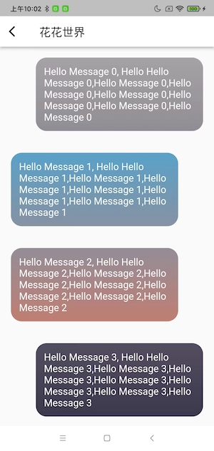

## 21. 流动渐变

渐变色在流动。 使用示例：

```
GradientBoundDemo();
```

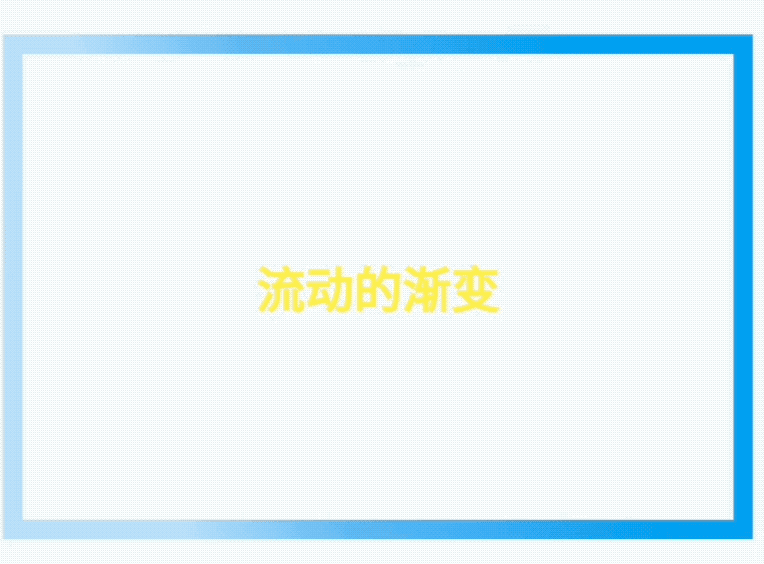


## 22. 模糊图片

高斯模糊，设置模糊图片。 使用示例：

```
const BlurImageDemo()
```

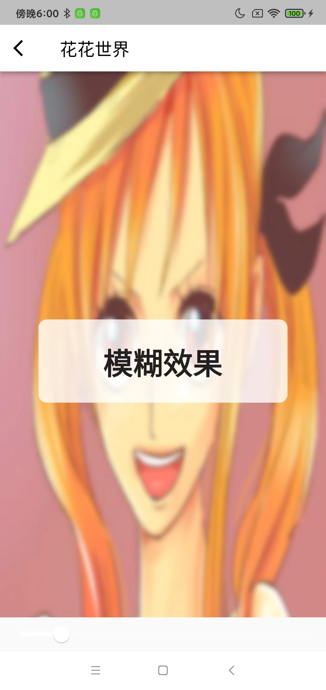

## 23. 闪电

模拟一条闪电，随机路线，从屏幕上方向下方闪过。 使用示例：

```
const Lightning()
```

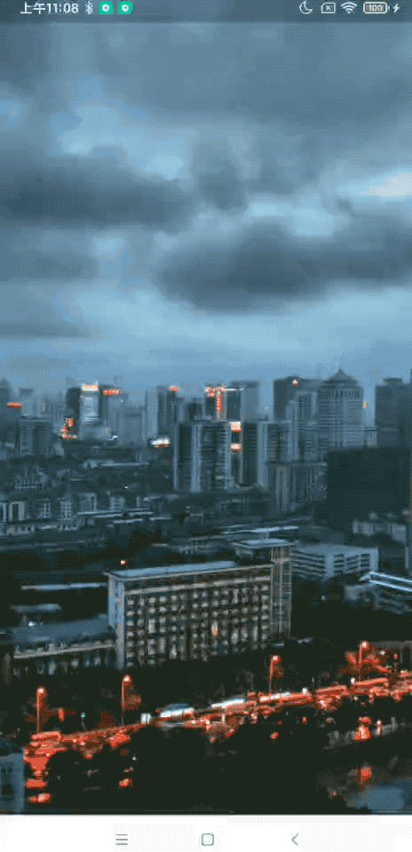

## 24. 加载动画

单个转圈，双个转圈和钟摆的加载动画。 主要还是使用到了computeMetrics来获取到每一时刻的位置，然后进行绘制圆点。 使用示例：

```
BallLoading(),
DoubleBallLoading(),
ClockPendulum(),
```

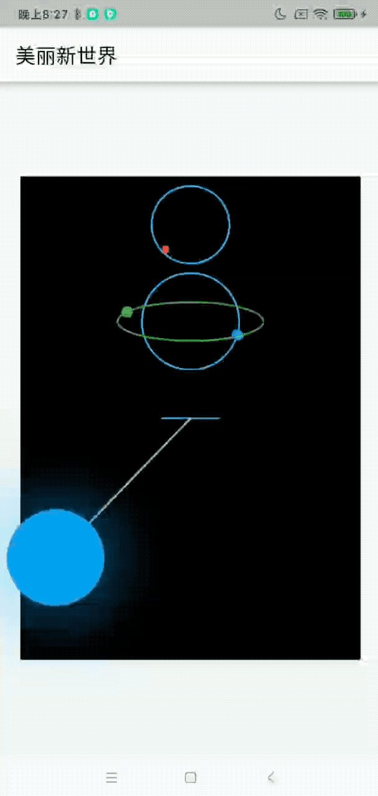

## 25. 加载动画（转圈）

圆形、椭圆（可修改路径支持任何形状） 使用示例

```
LoadingAnimations(
  bgColor: Colors.white,
  foregroundColor: Colors.red,
  size: 300,
  loadingText: "我就是我，不一样的烟火",
)
```

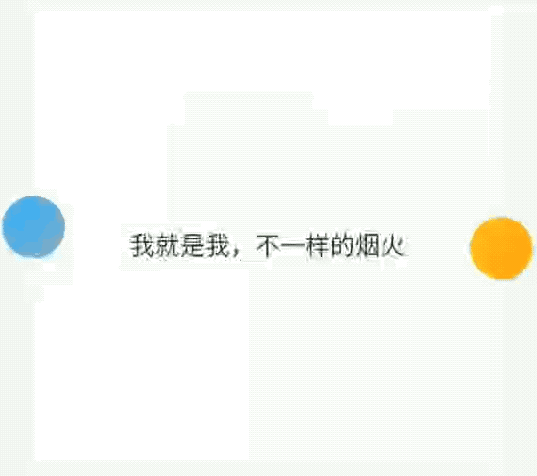

## 26. 秒表

秒表的外观，及时。 使用示例

```
StopWatchWidget()
```

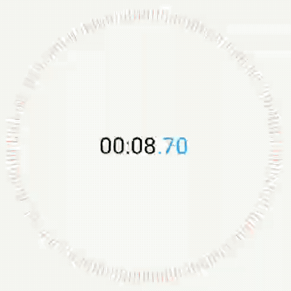

## 27. 图片展示进度条

上传或下载图片时，成功的进度清晰展示，未成功的模糊展示。 是用示例：

```
ProgressImage(0.15);
```

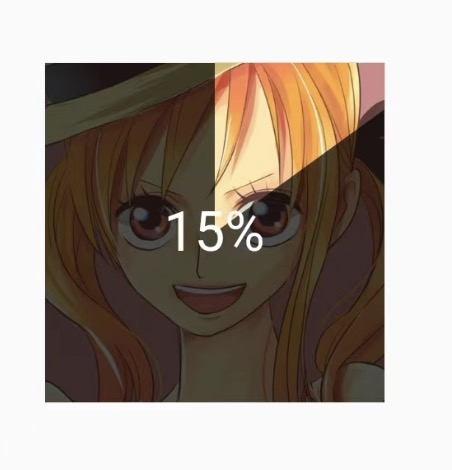

## 28. 风车

一直转动的四页风车。使用CustomPainter的repaint传入一个动画来实现。
可以将风车设置成其他页数。

```
Windmill()
```


## 29. 霓虹灯文本

霓虹灯文本的「故障」效果的实现。

```
Container(
  color: Colors.black,
  child: const TearingText("美丽蝴蝶"),
)
```


## 30. 运动汽车

控制骑车的运动，包括转弯和前进。

```
const RunCar(),
```

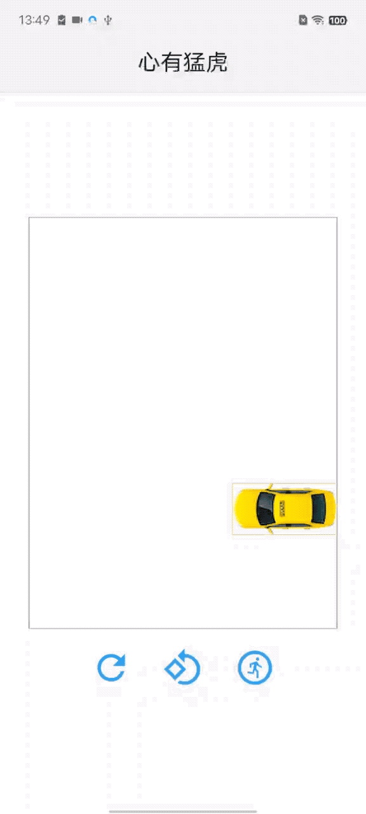

## 31. 计算器 （简单工厂模式）

简单的实现了加减乘除的计算，算法采用"工厂方法"设计模式。

```
const Calculator()
```

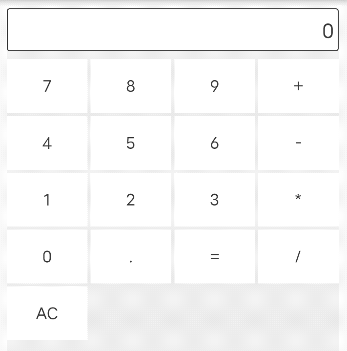

## 32. 收银系统 （策略模式）

收银系统，根据单价和数量，按计算方式得到金额。采用策略模式实现算法。

```
const CashierSystem()
```

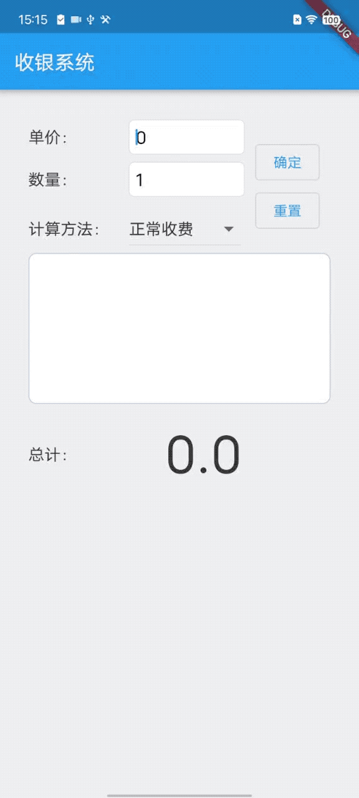

## 33.


