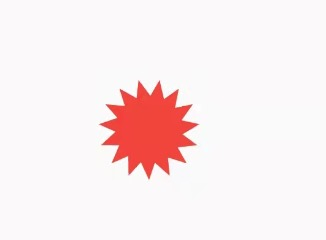

# FlutterSnippet
## 声明： 如果有任何代码侵权，请联系我wyn18968158629@gmail.com。 

在项目使用到或者网上看到好的组件，整理一份方便以后开发的时候使用。
## 1. FlutterText 字体抖动
一个字体抖动的组件，继承自Text。用法和Text一样，可以设置Text的所有属性。
可以传入一个动画的配置项，实现动画。支持重复播放。
使用示例：
```
FlutterText(
              "我们都是孩子",
              style: const TextStyle(fontSize: 30, color: Colors.cyan),
              config: AnimationConfig(curveTween: CurveTween(curve: Curves.ease), repeat: true),
            ),
```

## 2. NormalCell 一行显示左边的图标，标题，和右边的尾部组件
提供了（1）标题图片（2）标题（3）内容（4）尾部内容（或箭头）（5）是否需要底部分割线（6）点击事件
使用示例：
```
const NormalCell(leading: Text("leading"), title: Text("title"), middle: Text("middle"), trailing: Text("trailing")),
```

## 3. NStarView 多边形
绘制多边形，传入多边形的个数n，外半径R，内半径r，填充的颜色color
使用示例：
```
NStarView(15, 30, 20, color: Colors.red,)
```
